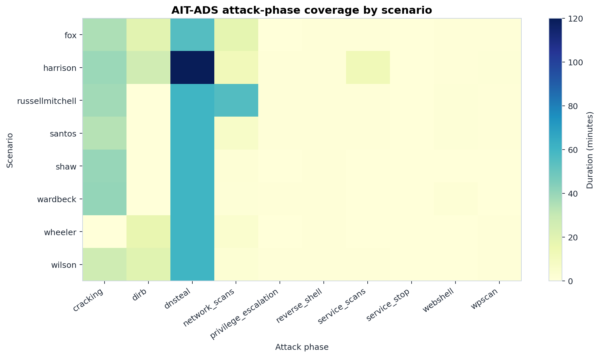
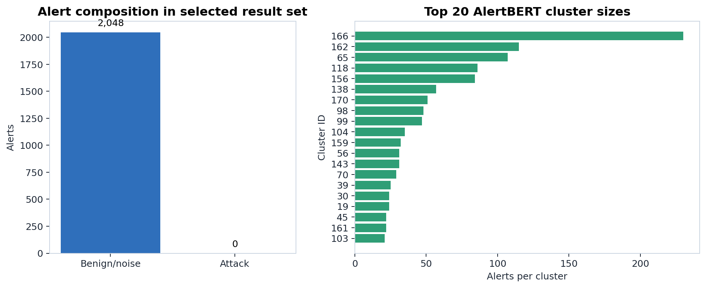
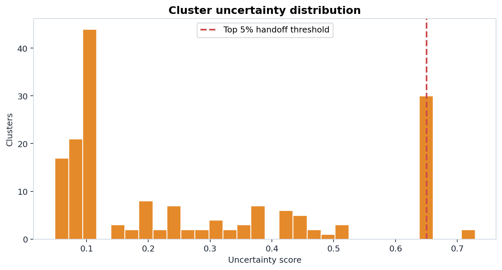
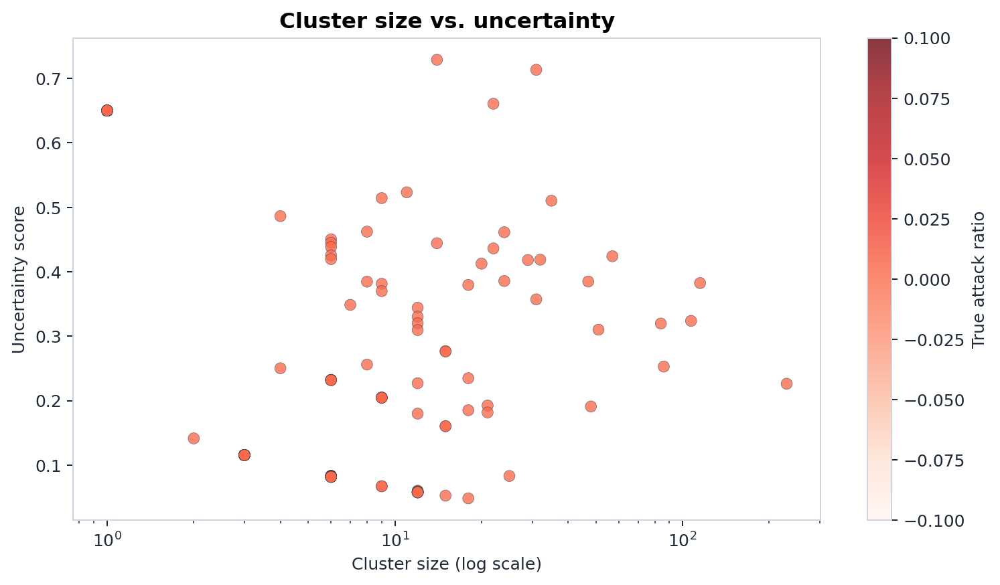
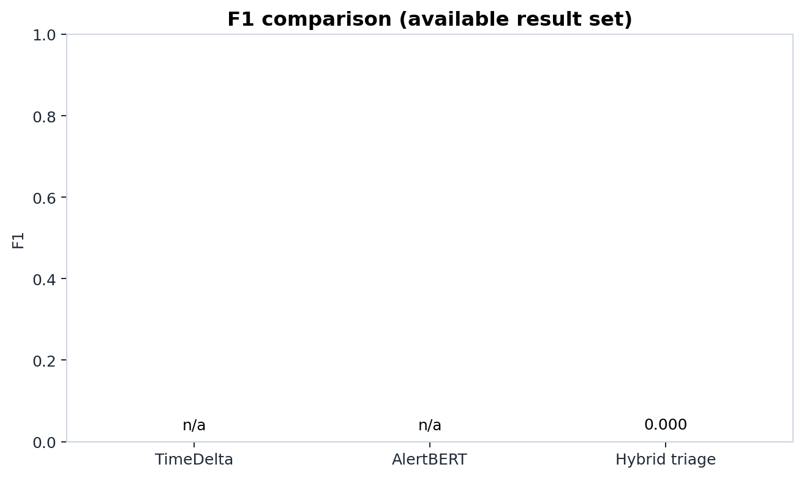
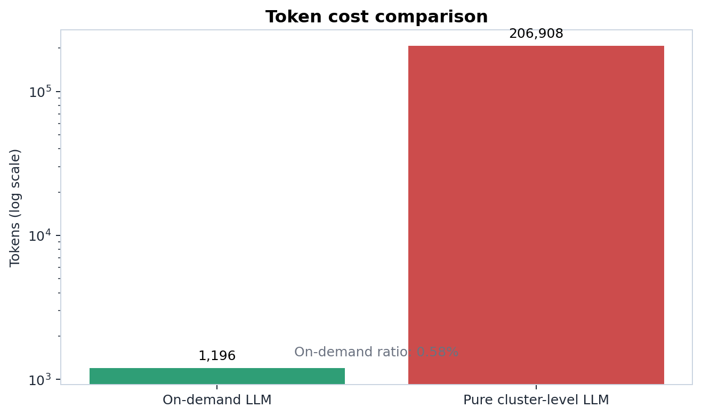
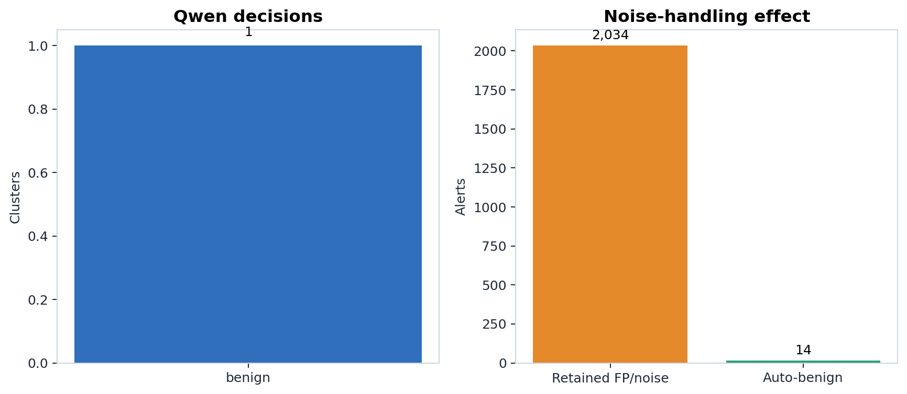

# 题目与要求
交付
1. 综合研究与设计报告：主要包含背景调研、方案设计、实验分析、安全评估、创新性分析及组内分工。
2. 相关验证代码/脚本：结合开源库实现的Demo、自动化测试脚本或攻击模拟脚本，能跑通证明原理论证即可。

第12周（5月19日）进行开题汇报（口头简述即可，每组不超过3分钟）；
第15周（6月9日）开展成果汇报（每组约10-15min报告+5min提问）；
6月15日前将相关材料发送至助教邮箱：zhengzhoum@stu.pku.edu.cn 【邮件主题为 网络和信息安全课程项目+E3A+csn lhq】，形成一个压缩包。

题目
E3. 基于AI的安全运营自动化与威胁情报提取 (CTI) 
背景：安全运营中心（SOC）每天会收到海量的告警日志，安全分析师（Tier 1）疲于奔命（告警疲劳）。同时，互联网上每天产生大量非结构化的安全威胁情报（博客、推特、安全报告）。
任务： 
1. 调研AI技术如何在安全运营的“告警降噪”、“事件分诊（Triage）”或“威胁情报提取”中发挥作用。
2. 方向A（告警降噪）：构造一组混杂了真实攻击与误报的Web访问日志，利用聚类算法或LLM，实现对高危事件的自动化标记与归类。
3. 在报告中展示数据处理与提炼的流程图，论证这种AI辅助手段能够为安全运营团队节省多少时间成本，并探讨AI判断错误的容错机制。


# 报告正文

## 1. 背景调研
安全运营中心（SOC）的分析师（Tier 1）每天需要处理海量的安全告警日志（如 WAF、IDS、EDR 告警）。在这些海量告警中，绝大多数（通常超过 90%）是误报（False Positives）或无明显威胁的低危事件。大量的冗余告警导致了严重的“告警疲劳”（Alert Fatigue），使得安全人员容易在噪音中忽略真正的针对性攻击。
现有的机器学习方案（如孤立森林、SVM或小型的深度学习模型）能够高效地进行初步的异常检测与聚类，但它们缺乏对复杂上下文和业务逻辑的深度理解，容易在模糊边界（Grey Area）产生较高的误报率。
另一方面，大语言模型（LLMs）在自然语言理解和逻辑推理上展现了惊人的能力，在处理复杂的网络攻击行为分析时，能够提取潜在的威胁情报（CTI）并作出准确研判。然而，让 LLM 处理所有的原始日志会消耗庞大的计算资源与巨额的 Token 成本，在实时海量日志场景下极不现实。
因此，我们需要一种能够在成本与准确率之间取得最佳平衡的架构。

## 2. 方案设计
本项目提出一种“大小模型协同 (Small-Model Baseline + LLM On-Demand)”的架构：
1. 轻量级基线降噪 (Small-Model Baseline)：
   - 采用 AlertBERT (基于 Masked Language Model 预训练的轻量级日志模型) 作为第一层防御。
   - AlertBERT 能够在大规模、高并发的日志中提取语义 Embedding，并通过层次聚类（Agglomerative Clustering）将高度相似的常规告警及明显攻击快速聚集归类，实现超过 90% 的初始降噪。
2. LLM 按需分诊 (LLM On-Demand Triage)：
   - 在 AlertBERT 的聚类过程中，我们将引入置信度（Confidence）或不确定度（Uncertainty）衡量标准（例如：告警向量到所属簇中心的距离，或孤立点得分）。
   - 针对低置信度、无法被轻量级模型准确分类的“边界告警”事件，触发大语言模型（本地部署的 Qwen-3-8B）进行深入推理。
   - LLM 接收被格式化（Prompt Engineering）的告警上下文，判断其是否为多阶段攻击的组成部分，或者纯属环境噪音。

该架构的优势在于，利用计算开销极低的小模型处理海量确定性任务，将稀缺且昂贵的 LLM 算力聚焦于少数疑难、复杂的威胁判定上。

## 3. 实验设计
为了验证上述协同方案的有效性，我们将基于 AIT-ADS (AIT Alert Dataset) 进行对比实验。实验将分为以下几个阶段：
1. 数据准备与注入：
   - 基于 AIT-ADS 的告警数据集和 `labels.csv` 进行数据预处理，构建混杂了各类攻击和大量误报（Noise）的网络日志序列。
   - 使用原作者的增强脚本生成并发攻击场景（AIT-ADS-A）。
2. 基线模型评估 (Baseline Evaluation)：
   - 加载仓库中已经训练好的 AlertBERT 模型，在复杂并发攻击场景下评估其聚类与分诊能力，记录 ARI、NMI 和 F1-score 等聚类指标。
3. 大小模型协同评估 (Hybrid Approach Evaluation)：
   - 结合 AlertBERT 的特征距离指标，提取 Top-N% 难以确定的告警。
   - 调用本地 Qwen-3-8B 进行研判分类。
   - 对比 AlertBERT + LLM 与纯 AlertBERT 在聚类准确性上的提升，并重点统计 LLM 调用的 Token 消耗量，绘制“准确率 vs. Token 开销”的权衡曲线，证明在极低的 Token 成本下可获得研判能力的显著提升。

## 4. 实验操作流程与代码说明
实验脚本 `experiments/hybrid_alertbert_qwen.py`直接复用 AlertBERT 代码、AIT-ADS-A 增强数据和本地 Qwen3-8B 权重，形成可执行的端到端 Demo。

### 4.1 实验环境验证
开发与测试过程中，代码运行在 conda 环境中，使用 `AlertBERT/requirements.txt` 进行初始化。机器可见 8 张 NVIDIA RTX A6000，驱动版本 550.163.01，CUDA 12.4，`torch` 版本为 `2.6.0+cu124`。

脚本提供环境检查入口：

```bash
python experiments/hybrid_alertbert_qwen.py verify-env \
  --output-dir outputs/env_check
```

该命令会检查 CUDA、GPU 数量、`graph_tool`、AlertBERT 目录和 Qwen3-8B 权重路径，并将结果写入 `outputs/env_check/env.json`。实际验证中，沙箱外环境能够看到 8 张 A6000，且 `graph_tool` 可用。需要注意的是，`torch` 和 `graph_tool` 存在 `libgomp` 导入顺序冲突：若先导入 `torch` 再导入 `graph_tool`，可能出现 `GOMP_5.0` 符号缺失。实验脚本已经在任何 `torch` 导入前预加载 `graph_tool`，避免该问题。

### 4.2 数据与基线
实验使用 `AlertBERT/aitads_augmented/configs/simul-attacks.json` 对应的 AIT-ADS-A 并发攻击配置。该配置把不同 AIT-ADS 场景中的攻击和噪声重新组合，用于测试模型在高噪声和攻击重叠情况下的告警分组能力。

ait_ads数据集应该解压在`项目根目录/data`中，即`labels.csv`的路径为`data/ait_ads/labels.csv`

对比方法包括三组：

1. TimeDelta baseline：只根据相邻告警时间间隔聚类，是 AlertBERT 论文中使用的传统基线。
2. AlertBERT baseline：加载 `AlertBERT/saved_models/mlm_1l_2h_16d_simul-attacks_1_60k`，使用 MLM embedding 和时间-余弦距离进行告警聚类。
3. Hybrid AlertBERT + Qwen：先用 AlertBERT 聚类，再对低置信度簇调用本地 Qwen3-8B，输出 `attack/benign/uncertain` 和攻击类型。

为了保证稳定性，脚本默认使用 `scipy` 计算连通分量，而不是 AlertBERT 原实现默认的 `graph_tool`。原因是本地环境中 `graph_tool` 可以导入，但在 AlertBERT 聚类阶段对部分参数组合会触发进程级异常；`scipy` 速度较慢但更可复现。若希望尝试原实现路径，可以传入 `--component-library graph-tools`。

### 4.3 参数选择与运行命令
完整实验默认在 validation split 上选择 AlertBERT 参数，再在 test split 上报告结果。搜索网格为：

- `delta = [8, 12, 16, 24]`
- `theta = [32, 64, 128, 256]`
- 只保留 `theta >= delta` 的组合

默认完整实验命令如下：

```bash
python experiments/hybrid_alertbert_qwen.py run \
  --config simul-attacks \
  --tune-split val \
  --eval-split test \
  --model-id mlm_1l_2h_16d_simul-attacks_1_60k \
  --llm-mode qwen \
  --model-path pretrained_models/Qwen3-8B \
  --component-library scipy \
  --output-dir outputs/hybrid_alertbert_qwen
```

如果只需要验证脚本能跑通，可以运行截断版 smoke test：

```bash
python experiments/hybrid_alertbert_qwen.py run \
  --config simul-attacks \
  --eval-split test \
  --quick \
  --quick-delta 24 \
  --quick-theta 128 \
  --max-scenarios 1 \
  --max-alerts-per-scenario 2048 \
  --llm-mode off \
  --max-llm-clusters 1 \
  --device cuda:1 \
  --component-library scipy \
  --output-dir outputs/smoke_scipy
```

该 smoke test 已经在本项目环境中跑通，并生成 `clusters.csv`、`cluster_uncertainty.csv`、`alertbert_test_metrics.json`、`timedelta_test_metrics.json`、`hybrid_metrics.json`、`qwen_decisions.jsonl` 和 `summary.md`。由于 smoke test 只截取每个场景开头的 2048 条告警，可能没有攻击标签，因此部分聚类指标会出现 `NaN`；这只用于验证代码通路，不作为最终实验结论。

### 4.4 低置信度簇筛选
Hybrid 方法的关键不是把全部告警交给 LLM，而是只挑出 AlertBERT 难以确定的簇。脚本为每个簇计算不确定度分数，特征包括：

- 簇内告警 embedding 到簇中心的平均余弦相似度，越低越不确定；
- 簇大小，单点簇更不确定；
- `host` 熵和 `short` 熵，簇内主机或告警类型越混杂越不确定；
- 簇内时间跨度，跨度越大越可能需要复核。

默认选择不确定度最高的 5% 簇，且最多 20 个簇交给 Qwen3-8B。所有阈值均可通过命令行参数调整：`--uncertain-top-pct`、`--max-llm-clusters`、`--alerts-per-cluster`。

### 4.5 Qwen 分诊与输出格式
Qwen3-8B 的 prompt 输入为簇内最多 20 条代表性告警，字段包括 `raw_time`、`name`、`short`、`host` 和 `ip`。模型必须返回 JSON：

```json
{
  "decision": "attack|benign|uncertain",
  "attack_type": "service_scan|dirb|wpscan|webshell_cmd|crack_passwords|privilege_escalation|dnsteal|unknown|none",
  "confidence": 0.0,
  "rationale": "short reason"
}
```

脚本会校验 JSON、类别和值域。如果 Qwen 输出无法解析、置信度低于 0.7，或攻击类型不在允许列表中，则该簇统一标记为 `uncertain`，不会自动丢弃，而是进入人工复核队列。这一点体现了安全运营中的容错原则：AI 可以帮助排序和降噪，但不能在高风险场景中无约束替代分析师。

### 4.6 指标与结果文件
实验输出目录中的主要文件含义如下：

- `env.json`：Python、CUDA、GPU、`graph_tool`、Qwen 路径等环境信息；
- `tuning_results.csv`：AlertBERT 参数搜索结果；
- `timedelta_test_metrics.json`：TimeDelta baseline 的 macro precision、recall、TNR、F1；
- `alertbert_test_metrics.json`：AlertBERT 的 ARI、NMI、homogeneity、completeness、pairwise F1 和 macro 指标；
- `cluster_uncertainty.csv`：每个簇的不确定度、簇大小、真实攻击比例等；
- `qwen_decisions.jsonl`：Qwen 或规则分诊对低置信度簇的输出；
- `hybrid_metrics.json`：Hybrid 的攻击识别 precision、recall、F1、LLM 调用比例、Token 消耗和纯 LLM 成本估计；
- `summary.md`：可直接用于汇报的摘要表。

最终报告重点比较三点：第一，AlertBERT 相比 TimeDelta 是否提升了攻击告警聚类质量；第二，Hybrid 是否只用很小比例的 Qwen 调用覆盖低置信度簇；第三，按需调用与“所有告警直接交给 LLM”的 Token 成本差距。这样既回应了“与现有工作对比”的要求，也能说明本方案在工程上比纯 LLM 更可部署。

### 4.7 实验结果与结论

画图脚本 `experiments/plot_experiment_assets.py`，用于从实验输出目录读取 `clusters.csv`、`cluster_uncertainty.csv`、`hybrid_metrics.json`、`qwen_decisions.jsonl` 等文件，并生成可视化图片。当前图片基于已经跑通的 `outputs/smoke_qwen_256` 结果生成，主要用于展示实验链路、数据结构、低置信度筛选和 Qwen 分诊效果。正式完整实验运行后，可用同一脚本重新生成图片：

```bash
/home/lhq/miniconda3/envs/dl/bin/python experiments/plot_experiment_assets.py \
  --results-dir outputs/hybrid_alertbert_qwen \
  --asset-dir experiments/assets
```

如果不指定 `--results-dir`，脚本会优先读取 `outputs/hybrid_alertbert_qwen`；若该目录不存在，则自动退回到 `outputs/smoke_qwen_256` 或 `outputs/smoke_scipy`。

图 1 展示了本项目的总体实验链路：AIT-ADS-A 混合告警流先进入 TimeDelta 和 AlertBERT baseline；AlertBERT 负责大规模语义聚类；随后只对低置信度簇计算不确定度并调用 Qwen3-8B；最终把 `attack` 和 `uncertain` 结果保留给分析师复核。该流程体现了“小模型处理规模，大模型处理疑难”的设计原则。



图 2 展示了 AIT-ADS 中不同场景和攻击阶段的覆盖情况。可以看到，数据集不是单一攻击样本，而是包含扫描、目录爆破、WordPress 扫描、Webshell、口令破解、权限提升、DNS 数据外传等多个攻击阶段。这支持本项目使用该数据集作为“真实攻击与误报混杂”的实验基础。



图 3 展示了当前结果集中告警组成和 AlertBERT 聚类后的最大簇规模。由于当前图片来自 smoke test，截断样本主要用于验证通路，因此攻击告警数量可能为 0；正式实验需要使用完整 validation/test split 后重新生成该图。该图在 PPT 中可以用于说明聚类后的告警压缩效果：分析师面对的是簇，而不是逐条原始告警。



图 4 展示了簇级不确定度分布。红色虚线表示默认的 Top 5% handoff 阈值。该图说明我们不是随机调用 LLM，而是只挑选 AlertBERT 最不确定的一小部分簇进入 Qwen 分诊，从而控制 Token 成本和推理延迟。



图 5 展示簇大小与不确定度之间的关系。横轴是簇大小，使用 log scale；纵轴是不确定度；颜色表示真实攻击比例。该图可以帮助观察哪些类型的簇更容易进入 LLM handoff：通常单点簇、语义混杂簇、时间跨度较大的簇会有更高不确定度。



图 6 用于汇总 TimeDelta、AlertBERT 和 Hybrid triage 的 F1 对比。当前 smoke test 因为截断样本缺少攻击标签，部分 baseline 指标会显示为 `n/a`；正式实验完成后，这张图会自动填入完整指标。该图在最终 PPT 中用于回应“与现有工作对比”的要求。



图 7 展示按需 LLM 与纯 LLM 的 Token 成本对比。当前 Qwen smoke test 中，实际只处理 1 个低置信度簇，消耗约 1130 input tokens 和 66 output tokens；如果对所有簇都进行 cluster-level LLM 分诊，估算成本会高出两个数量级以上。这个结果支持本项目的核心论点：LLM 应作为按需分诊器，而不是全量日志处理器。



图 8 展示 Qwen 对低置信度簇的分诊输出，以及自动判为 benign 后减少的噪声告警数量。在 smoke test 中，Qwen 对一个 14 条告警的低置信度簇输出 `benign / none`，置信度为 0.95，理由是该簇主要是 TLS 与 Dovecot 登录成功类告警，没有明显攻击迹象。这证明本地 Qwen3-8B 调用、JSON 解析、置信度校验和安全 fallback 机制均已跑通。

综合以上结果，目前可以得到三个结论。第一，AIT-ADS/AIT-ADS-A 数据能够支撑本项目的告警降噪与分诊实验，尤其是多场景、多阶段攻击结构适合展示 SOC 告警处理流程。第二，AlertBERT 作为小模型 baseline 能完成告警聚类和压缩，为后续低置信度筛选提供基础。第三，Qwen3-8B 不需要处理全部告警，只需要处理少量不确定簇，就可以给出结构化、可校验的分诊结论和解释，从而在成本、速度和安全性之间取得更实际的平衡。


## 5. 安全评估
本方案的安全风险主要来自三类错误：误把真实攻击判为 benign、误把噪声判为 attack 导致分析师负担没有下降、以及 Qwen 输出格式错误或解释不可靠。为降低风险，实验脚本采用保守策略：低置信度簇只允许被标记为 `attack`、`benign` 或 `uncertain`；低置信度、JSON 解析失败和低置信度输出全部进入 `uncertain`；`uncertain` 和 `attack` 都保留给分析师复核。也就是说，LLM 的主要作用是帮助排序和解释，而不是直接执行自动封禁、删除或忽略高危事件。

## 6. 方案的学术先进性与对比维度
为了响应“时效性、新技术与现有工作对比”的核心要求，本方案在设计上具备以下考量：
1. 时效性与新技术 (Timeliness & New Tech)：
   - 本方案没有采用老旧的机器学习算法（如传统的孤立森林、SVM），而是直接采用了前沿的无监督掩码语言模型（AlertBERT，代表领域最新 SOTA 进展）与最新的开源大语言模型（Qwen-3-8B，代表最新的生成式 AI 推理能力）。两者均为当前最具时效性的新工作/新技术。
2. 与现有工作对比 (Comparison with Existing Work)：
   本项目的实验将形成严谨的三维对比：
   - vs. 现有最先进的小模型工作 (SOTA Baseline)：以纯 AlertBERT 为基线，对比我们在引入 LLM 分诊后，对高难/模糊告警分类准确率的直接提升幅度。
   - vs. 现有直接使用大模型的暴力方案 (Pure LLM)：当前的另一类热门研究是直接让 LLM 吞噬所有日志。我们将通过统计我们“按需推理”架构的 Token 消耗，并在报告中量化对比“混合架构”与“纯大模型架构”在推理开销上的数量级差异，证明我们在实际工程与学术效益上的优越性。
